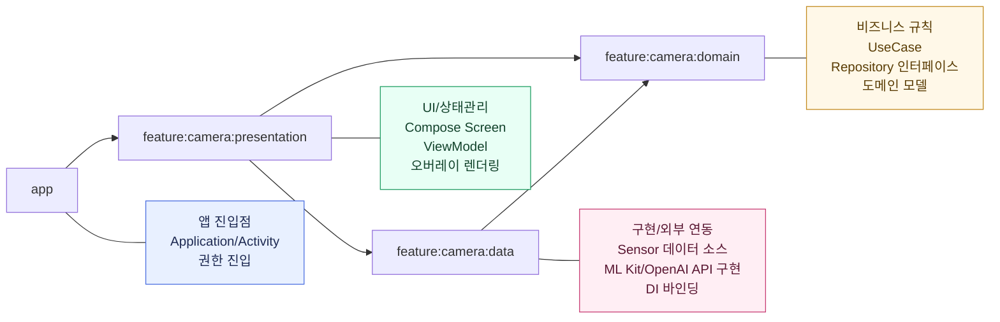

# CompositionCamera

실시간 카메라 구도 가이드를 제공하는 Android 앱입니다.  
수평/3분할 오버레이, 인물/사물 감지, 인원수 기반 인물 구도 추천, OpenAI 기반 피드백을 지원합니다.

## 주요 기능
- 실시간 오버레이
  - 3분할선
  - 수평선(기기 기울기에 따라 각도 변경, 수평 여부 색상 표시)
- 인물/사물 모드
  - 인물: 얼굴 감지, 바운딩 박스, 인원수(1명/2명/3명 이상)별 구도 점수 및 추천 문구
  - 사물: 객체 감지, 바운딩 박스 및 라벨 표시
- AI 피드백
  - 인물 모드에서 구도 메트릭을 기반으로 OpenAI API 호출
  - 실시간 로컬 규칙 피드백과 함께 AI 코멘트 표시
- 통합 로깅
  - `Logx`(Timber 래퍼) 사용

## 기술 스택
- Kotlin, Coroutines, Flow
- Jetpack Compose
- CameraX
- ML Kit (Face Detection, Object Detection)
- Hilt (DI)
- Timber (`Logx`)
- OpenAI API
- 아키텍처
  - 클린 아키텍처 (Domain / Data / Presentation)
  - 멀티 모듈 아키텍처
    - `app`
    - `feature:camera:domain`
    - `feature:camera:data`
    - `feature:camera:presentation`

## 프로젝트 구조
```text
CompositionCamera/
├─ app/
├─ feature/
│  └─ camera/
│     ├─ domain/
│     ├─ data/
│     └─ presentation/
├─ gradle/
└─ scripts/
```

## 권한
- `CAMERA`
- `INTERNET`

## 모듈별 책임 다이어그램


